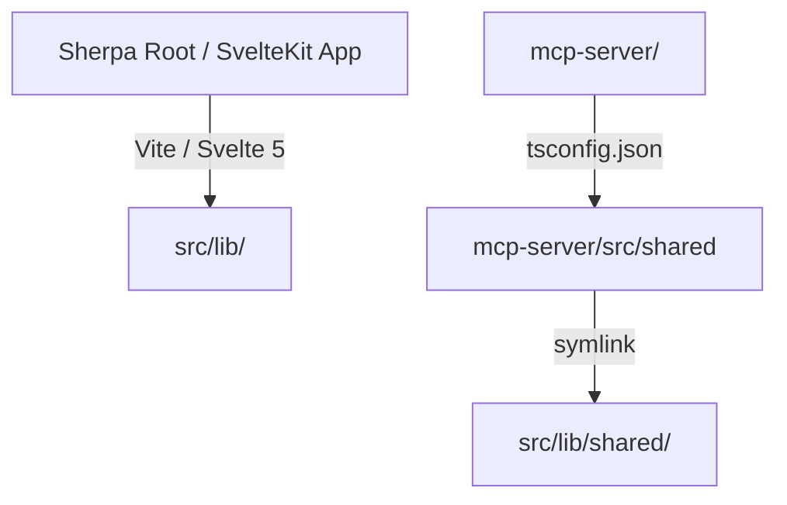
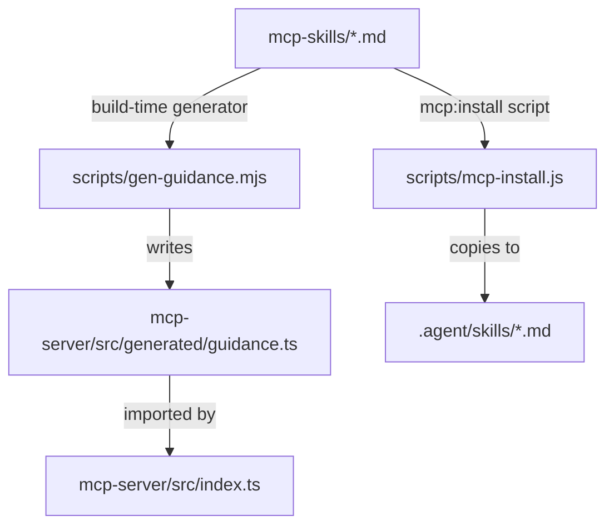

# Sherpa MCP Architecture & Maintenance Guide

This document defines the architecture of the Sherpa Model Context Protocol (MCP) server, its interface surfaces, how client guidance is synchronized across different hosting environments, and the rules for maintaining this boundary.

---

## 1. Purpose & Topology

Sherpa exposes its local-first AI ROI modeling engine to LLM hosts via a standalone MCP server (`mcp-server/`). The codebase is split into two TypeScript projects sharing a pure core library:

- **Root project (`src/`)**: A SvelteKit web application and SQLite database dashboard.
- **MCP project (`mcp-server/`)**: A Node.js CLI process executing over `stdio` or a custom transport wrapper.
- **Shared core (`src/lib/shared/`)**: Consumed by both. Changes here require rebuilding the MCP server (`cd mcp-server && npm run build`).
- For general project setup, see [CLAUDE.md](file:///Users/piotrlangowski/Documents/Sherpa/CLAUDE.md).

---

## 2. Exposure Surfaces & Host Matrix

The MCP server presents four interfaces to the consuming LLM host (e.g., Claude Desktop, Claude Chat, or the Antigravity developer CLI):

1. **Tools (13)**: Structured JSON-RPC methods defined in `mcp-server/src/index.ts` using Zod schemas for input validation.
2. **Resources (2)**: Read-only URIs using the `sherpa://` scheme to query cached calculation data.
3. **Prompts**: Named system-instruction templates.
4. **Instructions**: A global system prompt loaded during MCP initialization that provides context to the host (host-dependent, typically appended to system instructions).

### Surface → Host Transport Matrix

| Surface | Claude Desktop (Local stdio / `.mcpb`) | Claude Chat / Cowork (Remote Transport) | Claude Code CLI / Antigravity |
| :--- | :--- | :--- | :--- |
| **Tools** | Yes (via stdio) | Yes (via remote gateway) | Yes (via local process) |
| **Resources** | Yes (via stdio) | Yes (via remote gateway) | Yes (via local process) |
| **Prompts** | Yes (Dynamic prompts) | Yes (Dynamic prompts) | Yes (Dynamic prompts) |
| **Instructions** | Yes (`instructions` capability) | Yes (`instructions` capability) | Yes (`instructions` capability) |
| **Local Skills (Non-MCP)** | No | No | Yes (reads `.agent/skills/` on disk) |

---

## 3. Single Source of Truth Guidance Flow

To prevent documentation drift, all LLM guidance is written in `mcp-skills/*.md` and compiled at build-time:

### The Frontmatter Surface Contract
Every markdown file in `mcp-skills/` must start with YAML frontmatter specifying its target surface:

- **`surface: instructions`** (e.g., `sherpa-overview.md`): Compiled into `SERVER_INSTRUCTIONS` and passed to the MCP server configuration.
- **`surface: prompt`** (e.g., `sherpa-catalog-manager.md`): Registered dynamically as an MCP prompt template.
- **`surface: dev`** (e.g., `sherpa-patterns.md`): Contributor/developer doc; copied to the local CLI `.agent/skills/` folder, but skipped for server-level prompts to keep host context windows lean.

---

## 4. Maintenance Rules

When you modify the MCP boundary or catalog parameters, follow these strict synchronization rules:

### Rule A: When modifying tool schemas or behaviors
1. Edit the Zod schemas and tool handlers in `mcp-server/src/index.ts`.
2. Update the Zod field `.describe()` chains to keep them self-sufficient.
3. Update the matching one-liner descriptions in `mcp-server/manifest.json` `tools[]`.
4. Document the parameter changes in the corresponding prompt file in `mcp-skills/`.
5. Run `cd mcp-server && npm run build` to compile changes.

### Rule B: When modifying guidance or adding prompts
1. Edit or create the markdown file in `mcp-skills/` only. **Do not modify `guidance.ts` by hand.**
2. If adding a prompt, make sure the frontmatter has `surface: prompt` and a clear `name` and `description`.
3. Run `npm run check` or `npm run build` to run the generator and verify synchronization.

### Rule C: When changing shared schemas
1. Modify `src/lib/shared/types.ts` or related files.
2. Recompile the MCP server (`npm run build` in `mcp-server/`).
3. Stamp the version correctly during release: `npm run mcp:pack`.

---

## 5. Catalog of Exposed Surfaces

### Tools Inventory (14)
- **`settings_action`**: Global settings (currency, WACC, default projection length, credit pricing).
- **`client_base_action`**: Default client base parameters and uplifts.
- **`provider_action`**: AI model provider listings, token costs, and credit conversion.
- **`vertical_action`**: Vertical markets and TAM/SAM/SOM targets.
- **`cohort_action`**: Customer cohorts and retention/acquisition metrics.
- **`cost_item_action`**: Capex/Opex fixed cost entries.
- **`service_action`**: Individual AI features (input/output tokens, request volumes).
- **`pack_action`**: Feature pack bundles.
- **`plan_action`**: SaaS pricing subscription tiers.
- **`scenario_action`**: Lifecycle management, tornado analysis, scenario comparison, and projections.
- **`dashboard_action`**: Open/close/deep-link to local SvelteKit web client.
- **`monetization_action`**: Monetization configurations (addons, usage billing, hybrid structures).
- **`scenario_override_action`**: Scenario-specific cohort behavioral parameter overrides (monthly_churn_rate, base_arpu, ai_adoption_rate, etc.).
- **`entity_override_action`**: Per-scenario overrides of a catalog entity's financial parameters without cloning it — service tokens/fixed cost, cost amount/frequency, provider input/output prices, plan base_price (`scenario_entity_overrides`).

### Resources Inventory (2)
- **`sherpa://dashboard/summary`**: Returns list of all scenarios, settings, and cached values.
- **`sherpa://scenarios/{id}/results`**: Returns monthly customer growth, MRR, cash flows, and token costs.

### Prompts Inventory (5)
- **`sherpa-catalog-manager`**: Direct CRUD workflows for the AI catalog and fixed costs.
- **`sherpa-scenario-manager`**: Setting up scenario scopes, override cascades, and rolling out plans/services.
- **`sherpa-financial-analyst`**: Resolving NPV, IRR, payback, and sensitivity variables.
- **`sherpa-scenario-comparator`**: Performing trade-offs, calculating opportunity cost, and deep-linking to the dashboard.
- **`sherpa-monetization`**: Setting up monetization policies and overrides.

---

## 6. Verification and Troubleshooting

- **Local testing inspector**: Run `npm run mcp:inspect` from the root. This launches the MCP Inspector, allowing you to test tools and verify instructions/prompts immediately without a host app.
- **Drift guard**: Run `npm run check` (or `node scripts/check-guidance.mjs`). This throws a non-zero exit code if the committed `guidance.ts` is out of sync with `mcp-skills/`.
