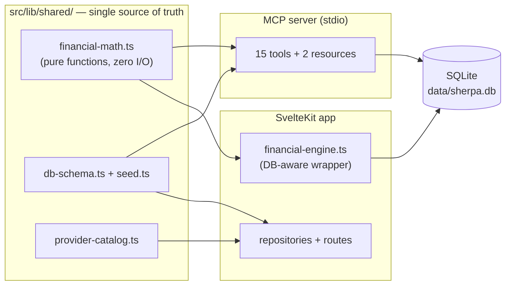

# Sherpa — AI Feature ROI Calculator for SaaS

[](https://github.com/piotrlangowski/Sherpa/actions/workflows/ci.yml)
[](LICENSE)


**Should we ship that AI feature?** Sherpa answers with CFO-grade numbers instead of gut feeling: it combines a cohort-based revenue model with an LLM token cost engine and CAPEX/OPEX tracking, and turns them into NPV, IRR, payback period, TCO and ROI — locally, with nothing leaving your machine.

Built for product leaders (CPO/RevOps) at SaaS companies, it also ships as an **MCP server**, so you can model scenarios conversationally from Claude Desktop: *"create a scenario with 5,000 users, 4% churn and a $150 ARPU chatbot rollout"*.

<!-- TODO(screenshots): docs/screenshots/dashboard.png — scenario dashboard with KPI cards and cashflow chart -->
<!-- TODO(screenshots): docs/screenshots/tornado.png — sensitivity analysis tornado chart -->
<!-- TODO(screenshots): docs/screenshots/wizard.png — 4-step scenario creation wizard -->
<!-- TODO(screenshots): docs/screenshots/mcp-claude-desktop.png — creating a scenario from natural language in Claude Desktop -->

<!-- TODO(demo): link the 2-minute walkthrough video here -->

---

## Why it's different

Typical ROI calculators don't understand LLM economics; token cost calculators don't understand revenue. Sherpa models both sides of the equation in one place:

- **Revenue side** — cohort projections with exponential retention decay (`retention(n) = max(floor, e^(-λ·n))`), acquisition growth, ARPU expansion, and an AI-adoption overlay that controls which users actually generate token costs.
- **Cost side** — per-service LLM token costs (input/output prices per model, requests per user), plus CAPEX/OPEX items (engineering, infrastructure, marketing, compliance).
- **Decision layer** — monthly discounted cashflows rolled up into NPV, IRR (Newton-Raphson with bisection fallback), payback period (with linear interpolation), TCO and ROI%.

## Features

- **Catalog** — define AI services (chat, summarization, search…), assign provider models, group services into feature packs, map packs onto pricing plans, and visualize service dependencies as a DAG.
- **Scoped scenarios** — target the whole client base, selected verticals, or individual cohorts, with a three-level parameter override cascade (global → vertical → cohort).
- **Sensitivity analysis** — tornado charts showing how ±10% swings in churn, acquisition, ARPU, token costs, adoption and discount rate move the NPV.
- **Scenario comparison** — side-by-side KPIs, cumulative ROI curves and opportunity cost (ΔNPV) between alternatives.
- **Import & export** — model your real customer base from a CSV export (CRM/billing), export scenarios to JSON/CSV, download the dashboard as a high-res PNG.
- **Current model prices** — bundled price list for OpenAI, Anthropic and Google models with a visible "prices as of" date and one-click sync.
- **MCP server** — 15 tools and 2 resources exposing the same engine to LLM hosts; includes natural-language scenario generation and 4 bundled agent skills.

## Architecture

Two independent TypeScript projects share one engine through a symlink — the financial math, domain types, DB schema and demo seed live in `src/lib/shared/` and are compiled into both:



Design decisions worth a look:

- **Pure core, impure shell.** All computation sits in [`financial-math.ts`](src/lib/shared/financial-math.ts) as pure functions (providers passed as arguments, zero DB access) — unit-tested at 99% statement coverage. The app and the MCP server are thin I/O wrappers around it, so both always produce identical numbers.
- **Scope override cascade.** A scenario can override cohort parameters at three levels (global → vertical → cohort), resolved by a single cascade function shared by both frontends.
- **Result cache with invalidation.** Computed KPIs are cached per scenario; every mutation path (services, providers, cohorts, costs…) cascades an invalidation so dashboards never show stale numbers.
- **Self-initializing MCP server.** On first run it creates the schema and demo data on its own, in an OS-appropriate user data directory — no web app required first.

## Quickstart

Requires Node.js ≥ 22.5 — it uses the built-in `node:sqlite` module.

```bash
npm install
npm run dev          # → http://localhost:5173
```

First launch opens a 3-step setup wizard and seeds a demo workspace ("Acme Analytics": 5 AI services, 2 feature packs, 2 pricing plans, 2 pre-computed scenarios), so you can explore a populated dashboard immediately.

```bash
npm run check        # svelte-check type checking
npm test             # vitest unit tests
npm run build        # production build (adapter-node)
```

## Claude Desktop integration (MCP)

Build the server and register it:

```bash
cd mcp-server && npm install && npm run build && cd ..
npm run mcp:install   # registers "sherpa-dev" in Claude Desktop config + installs agent skills
```

Restart Claude Desktop and ask things like:

> *Create a scenario named "AI Search rollout" with 2,000 starting users, 3% churn, $99 ARPU, Smart Search launching in month 2 — then run a sensitivity analysis on it.*

The dev registration pins the database to the repo's `data/sherpa.db` (via `SHERPA_DB_PATH`), so whatever you model in conversation shows up in the web dashboard and vice versa. For tool development without Claude Desktop, `npm run mcp:inspect` opens the MCP Inspector against the built server.

### One-click extension (.mcpb)

For non-technical users (no terminal, no Node required — Claude Desktop ships its own runtime):

```bash
npm run mcp:pack     # → sherpa.mcpb
```

Then in Claude Desktop: **Settings → Extensions → drag & drop `sherpa.mcpb`**. On first run the extension creates its own database (with the demo workspace) in the OS user data directory.

### Dev vs. packaged — separate environments

|  | `sherpa-dev` (development) | `Sherpa` extension (packaged) |
|---|---|---|
| Registered via | `npm run mcp:install` → `claude_desktop_config.json` | drag & drop `sherpa.mcpb` in Settings → Extensions |
| Code | `mcp-server/build/` straight from the repo | unpacked copy inside Claude Desktop |
| Database | repo `data/sherpa.db` — shared with `npm run dev` | `~/Library/Application Support/Sherpa/sherpa.db` (or a custom path set in the extension's settings) |
| Update loop | `cd mcp-server && npm run build`, restart Claude Desktop | re-pack and re-install the `.mcpb` |
| Reset | delete `data/sherpa.db` | delete the Sherpa user-data folder — next start re-seeds |

Keep only one of the two enabled at a time — both expose the same tool names, which confuses the model.

## Testing

The pure math core is the contract: [`financial-math.test.ts`](src/lib/shared/financial-math.test.ts) covers cohort modeling, NPV/IRR/payback/TCO and full-scenario calculation (99% stmt / 77% branch coverage, enforced thresholds in CI). The importer has its own suite. UI and integration layers are exercised by `svelte-check` and the CI build; treat the financial outputs as tested, the UI as best-effort.

## Privacy

Sherpa is local-first: every scenario, cohort and setting lives in a SQLite file on your disk (`data/sherpa.db`). The app makes no network calls to model providers — token prices come from a bundled, dated price list you can inspect and edit.

## License

[MIT](LICENSE)
